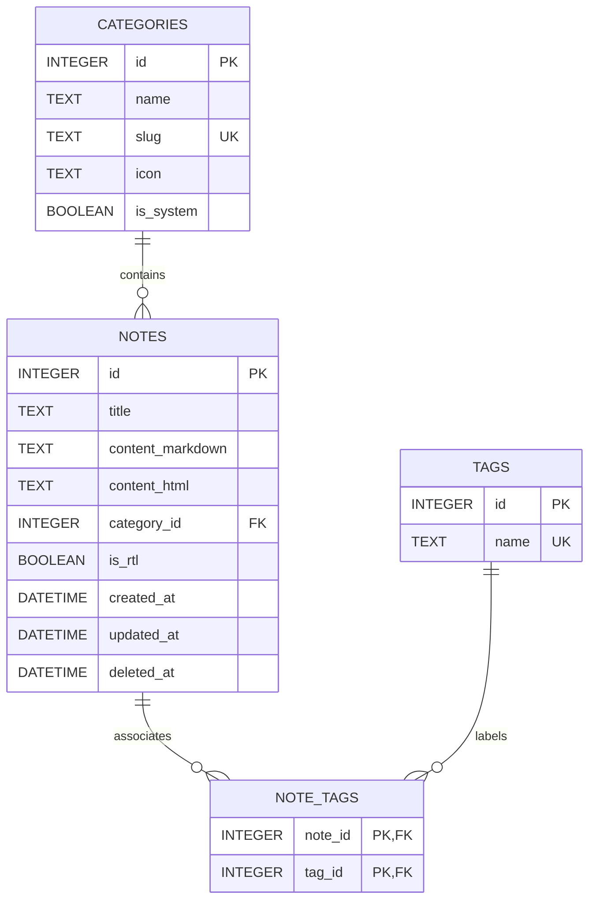

# NAS Notesbook - Project Registry

## 1. Product Intent
NAS Notesbook is a personal, local-first, RTL-first desktop notebook built for **SUFYAN's** daily workflow. It is the single local place to store ChatGPT prompts, NAS APP project contexts, custom instructions, PowerShell commands, development notes, technical errors, fixes, and reusable templates.

v1 is intentionally narrow: a fast, lightweight, offline Windows desktop app for one user—not a broad generic note-taking product for IT admins or general audiences.

---

## 2. Problem Statement
SUFYAN's current note-taking workflow suffers from key limitations:
1. **Poor RTL/Arabic Support:** Text editors often fail to handle mixed LTR (English code/terms) and RTL (Arabic text) gracefully, leading to broken cursor behaviors, misaligned bullet points, and unreadable code blocks.
2. **Cloud Dependency & Privacy:** Proprietary prompts, API behaviors, internal server configurations, and PowerShell administration scripts should not depend on external cloud platforms.
3. **Lack of ChatGPT Workflow Optimization:** There are no built-in shortcuts to copy notes optimized specifically as "ChatGPT Context" or formatted prompt templates alongside their system parameters.
4. **Bloat and Slow Performance:** Existing cross-platform notes applications are heavily bloated, require accounts, and do not behave like lightweight, snappy native utilities.

---

## 3. Target User
- **Primary user (v1):** SUFYAN — Arabic-speaking developer who uses Arabic for explanation/documentation and English for code, scripts, and technical terms.
- **Workflow focus:** Managing ChatGPT prompts, NAS APP project contexts, PowerShell snippets, and development notes in one local, searchable notebook.

v1 does **not** target a general IT-admin or multi-user audience. Future expansion is out of scope until the personal workflow is solid.

---

## 4. v1 Scope (Minimal)
The following capabilities define v1. Anything not listed here is deferred.

| Feature | v1 |
| :--- | :---: |
| Create note | ✓ |
| Edit note | ✓ |
| Delete to Trash | ✓ |
| Restore from Trash | ✓ |
| Categories | ✓ |
| Tags | ✓ |
| Search | ✓ |
| RTL/LTR handling | ✓ |
| Rich text editor | ✓ |
| Code blocks | ✓ |
| Copy note content | ✓ |
| Copy as ChatGPT context | ✓ |
| Import `.md` and `.txt` | ✓ |
| Export Markdown | ✓ |
| Autosave | ✓ |
| Local backup folder | ✓ |

**Explicitly out of v1 scope:** cloud sync (Dropbox, OneDrive, NAS sync), multi-user support, attachments, encryption, app lock, custom category creation, archive workflows beyond Trash, and any feature-parity pursuit with Notesnook or other note apps.

---

## 5. Non-Negotiable UX Rules
- **Local-First, No Cloud:** All note data, tags, and settings are stored locally in an SQLite database. No network calls, accounts, or telemetry in v1.
- **RTL-First Arabic Support:** Bi-directional text, Arabic typography, and mixed-language editing are first-class—not optional add-ons.
- **Code Blocks Stay LTR:** Code blocks, inline code, and command shells must never inherit RTL direction. They remain LTR with left-aligned monospaced fonts.
- **Layout Reference Only:** The three-panel layout (left navigation rail, middle notes list, main editor) is inspired by **Notesnook's visual structure** as a UX reference. Notesnook is **not** a feature target and **not** a source-code reference. NAS Notesbook does not replicate Notesnook features or behavior.
- **Comfortable Editor Width:** The editor workspace must be wide enough for desktop prompt writing and long technical notes. Do not hard-cap content to a narrow reading column in v1; a user-configurable width limit may be added later.
- **Compact Spacing:** High information density. Minimize padding and margin to fit text, code snippets, and controls comfortably without forcing excessive scrolling.
- **Keyboard-First Navigation:** Support global shortcuts for creating notes, searching, and switching categories.
- **Neutral Color Scheme:** Light neutral theme with high contrast, crisp typography, and standard font fallbacks to guarantee legibility under all conditions.

---

## 6. RTL & Arabic Handling Rules
To ensure a true RTL-first experience, the application must adhere to the following rules:
1. **Bi-directional Paragraph Detection:** Paragraphs should dynamically adjust their alignment (`direction: rtl` or `direction: ltr`) based on the first strong character typed (e.g., Arabic characters force RTL, Latin characters force LTR).
2. **Explicit Direction Toggles:** A manual toggle button must be present in both the top editor toolbar and the metadata header to force RTL or LTR for the entire note.
3. **Typography Stack:** The text editor and UI must use an optimal Arabic typography stack. Under Windows, the app prefers:
   ```css
   font-family: -apple-system, BlinkMacSystemFont, "Segoe UI", "Cairo", "Tahoma", "Arial", sans-serif;
   ```
4. **Code Blocks are Strict LTR:** Code blocks, inline code, and command shells must *never* inherit RTL direction. They must always remain LTR with left-aligned monospaced fonts to preserve indentation, braces, and syntax structures.
5. **Proper List Indentation:** List bullets, numbers, and checklists in RTL blocks must align on the right side with appropriate padding, preventing overlapping or clipping.

---

## 7. Notes Categories (Default Core)
The system initializes with a fixed set of default categories tailored to SUFYAN's workflow:
*   **All Notes:** Virtual category showing all active, non-deleted notes.
*   **Prompts:** ChatGPT prompts, prompt chains, and system instructions.
*   **ChatGPT Instructions:** Custom instructions and persona briefs.
*   **NAS Projects:** Context, requirements, and deployment notes for NAS APP projects, local files, servers, and scripts.
*   **PowerShell Commands:** Terminal snippets, command explanations, and automation scripts.
*   **Development Notes:** Technical logs, programming tips, and configuration guides.
*   **Errors & Fixes:** Troubleshooting logs structured as *Error Description*, *Root Cause*, and *Working Solution*.
*   **Templates:** Standardized skeletons for new projects, documentation, or recurring checklists.
*   **Trash:** Soft-deleted notes. Notes can be restored or permanently destroyed.

---

## 8. Data Model
The database is built on SQLite, utilizing relational integrity and full-text search extensions.



### Table Schema Details

#### `categories`
*   `id`: Primary Key, Auto-increment.
*   `name`: Category display name (e.g., "PowerShell Commands").
*   `slug`: Unique system identifier (e.g., "powershell-commands").
*   `icon`: Lucide icon reference name.
*   `is_system`: Boolean. True for default system categories which cannot be deleted.

#### `notes`
*   `id`: Primary Key, Auto-increment.
*   `title`: Text title of the note. Defaults to "Untitled Note" if left empty.
*   `content_markdown`: Clean markdown representation.
*   `content_html`: Rich-text editor representation (HTML string).
*   `category_id`: Foreign Key referencing `categories(id)`.
*   `is_rtl`: Boolean flag override for the note's text direction.
*   `created_at`: Datetime string (ISO-8601 UTC).
*   `updated_at`: Datetime string (ISO-8601 UTC).
*   `deleted_at`: Datetime string (ISO-8601 UTC). Nullable. Used for soft delete (Trash).

#### `tags`
*   `id`: Primary Key, Auto-increment.
*   `name`: Unique tag string (case-insensitive indexing).

#### `note_tags`
*   `note_id`: Foreign Key referencing `notes(id)` (On Delete Cascade).
*   `tag_id`: Foreign Key referencing `tags(id)` (On Delete Cascade).

---

## 9. Storage Strategy
- **SQLite Database Path:** Located in the user's roaming application directory to guarantee persistence across updates:
  `%APPDATA%/NAS Notesbook/storage.db` (on Windows).
- **Vite Integration:** SQLite commands run on the native side inside the Electron `main` process and are exposed to the React UI `renderer` process through a safe, secured context-isolated `preload` bridge.
- **No Heavy Client Memory Cache:** Data-fetching operates via explicit queries and parameterized IPC calls to keep application memory overhead under 150MB.
- **Future-Proofing for Security:** Schema supports a future transition to SQLCipher (for encrypted database-at-rest protection) by keeping data queries clean and centralized within a single database management class. Encryption is **not** in v1 scope.

---

## 10. Editor Requirements (Tiptap-based)
The Rich Text Editor must implement:
*   **Comfortable Desktop Width:** The editing surface uses the full available editor panel width. No narrow hard-cap in v1.
*   **Markdown Keyboard Shortcuts:** Typing `# ` creates a Header 1, `* ` starts a bulleted list, `` ` `` highlights inline, and ` ``` ` starts a block.
*   **Custom CodeBlock Component:** Supports basic programming language selection (PowerShell, TypeScript, HTML, CSS, Markdown, JSON, Bash) with a dedicated "Copy Code" overlay button. All code blocks render LTR by default.
*   **Copy as Prompt & Context Tools:**
    *   *Copy Note Content:* Copies the clean text or markdown translation.
    *   *Copy as ChatGPT Context:* Wraps the note contents in an XML wrapper styled for AI system instructions:
        ```xml
        <context name="Note Title">
        Note Markdown Content Here
        </context>
        ```
*   **RTL Block Level Attribute:** Inline alignment toggling that appends `dir="rtl"` to block nodes (paragraphs, headers, list items).

---

## 11. Search Requirements (SQLite FTS5)
- **FTS5 Virtual Table:** An FTS5 shadow table `notes_fts` will index `title`, `content_markdown`, and consolidated tag lists.
- **Search Query Construction:** Supports keyword prefix matching (e.g., `term*`) and boolean operations.
- **Instant Search:** Trigger queries on user keydowns, throttling requests using a 150ms debounce window to prevent interface lag.
- **Highlighting:** Matching search terms inside the note list column descriptions will be highlighted with a soft background.

---

## 12. Local Backup (v1)
v1 backup is a **simple local backup folder**—nothing more.
- The user picks any writable folder on their local drive via a native folder-picker dialog.
- On demand or after autosave (when a backup path is configured), the app copies note content as Markdown files organized by category.
- The backup path is stored in local app settings (SQLite settings table or equivalent).
- **Not in v1:** Dropbox, OneDrive, NAS sync, cloud upload, or any network-dependent backup target as a core requirement. The user may point the folder picker at a cloud-synced directory on their own machine, but the app does not integrate with or depend on those services.

---

## 13. File Responsibility Map
```
C:/Projects/NAS Notesbook/
├── assets/
│   └── icon.ico                       # Native Windows App Icon
├── docs/
│   ├── 01_Project_Registry.md         # This registry file
│   ├── 02_Product_Architecture.md     # Structural and DB flow design
│   ├── 03_UI_UX_Spec.md               # Detailed visual layouts and styles
│   └── 04_Phase_Implementation_Plan.md# Concrete coding steps
├── package.json                       # Core app and electron scripts
├── vite.config.ts                     # Build setup for Main and Renderer
├── src/
│   ├── main/
│   │   ├── index.ts                   # Electron core entrypoint
│   │   ├── db.ts                      # SQLite operations & FTS5 indexing
│   │   └── ipc.ts                     # IPC event handlers and listeners
│   ├── preload/
│   │   └── index.ts                   # Secure contextBridge API definition
│   └── renderer/
│       ├── index.html                 # App root html document
│       ├── main.tsx                   # React root launcher
│       ├── App.tsx                    # Main App Controller
│       ├── styles/
│       │   └── index.css              # Global styles & Tailwind configuration
│       ├── components/
│       │   ├── NavigationRail.tsx     # Left vertical bar (Categories & Settings)
│       │   ├── NotesListColumn.tsx    # Middle list view of notes
│       │   ├── NoteEditorArea.tsx     # Main Tiptap rich-text workspace
│       │   ├── StatusFooter.tsx       # Bottom status bar (character count, path, save status)
│       │   └── Dialogs/               # Modals for Backup, Markdown Import/Export
│       └── hooks/
│           └── useDebounce.ts         # Utility for input throttling
```

---

## 14. Known Failure Points
1. **SQLite Database Locking (`SQLITE_BUSY`):** Occurs if asynchronous write operations collide. Resolved by enforcing a single database connection using a serialized write queue and setting `journal_mode = WAL`.
2. **Preload Security Escapes:** Passing raw database handlers across IPC can expose the app to code injection vulnerabilities. Mitigated by restricting the exposed `contextBridge` to highly specific, validated methods with strict input sanitization.
3. **Cursor Glitching in Mixed RTL/LTR Text:** Editing words at transition boundaries in Tiptap can move the cursor unpredictably. Resolved by configuring global styles for inline direction wrappers and using strict block-level attributes.
4. **Backup Target Write Permissions:** If the chosen local backup directory is write-protected or unavailable, backup fails. Handled by checking folder access recursively (`fs.promises.access`) and reporting detailed toast errors in the UI.

---

## 15. Debug Checklist
*   [ ] **SQLite Verification:** Run standalone queries in PowerShell to verify table integrity and FTS5 compatibility.
*   [ ] **IPC Log Monitor:** Keep a verbose logger enabled in dev mode that prints all IPC requests and payload arguments to the terminal console.
*   [ ] **Vite HMR Check:** Ensure renderer updates do not clear or recreate active Electron window instances.
*   [ ] **RTL Flow Inspector:** Validate mixed-language alignment, cursor positioning, and bullet offsets using Chrome Developer Tools inside the Electron window.
*   [ ] **Exception Handling Wrapper:** Ensure all database read/write queries are wrapped in `try/catch` and bubble errors back to the renderer safely instead of crashing the main thread.

---

## 16. Change Log
*   **v1.0.0:** Initial structure design, schema specifications, security rules, and implementation blueprints compiled.
*   **Documentation Review Fixes:** Aligned all docs to personal (SUFYAN) v1 scope. Removed broad IT-admin/general-user positioning. Added explicit minimal v1 feature list. Simplified backup to local folder only (no Dropbox/OneDrive/NAS sync as core requirements). Clarified Notesnook as layout-only UX reference. Preserved RTL-first and LTR code-block rules. Removed narrow editor width cap; editor uses full panel width for prompt writing. Dropped `is_archived` and Archive category from v1 data model.
