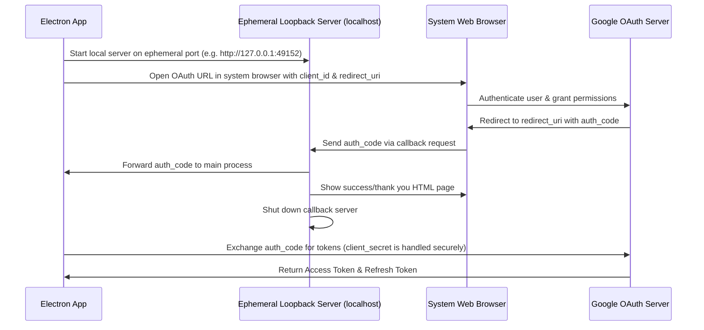

# NAS Notesbook — Google Link & Cloud Backup Technical Planning

This planning document outlines the technical design, security protocols, user interface design, and roadmap for adding Google account linking and cloud backup support to NAS Notesbook.

---

## 1. Recommended Cloud Backup Strategy

We recommend a hybrid model with **Google Drive as the primary cloud backup target**, and **Gmail/email export as an optional future feature**.

### Why Google Drive as Primary?
1. **Structured Storage**: Google Drive provides folder and file hierarchies, allowing clean tracking of database backups, settings files, and metadata.
2. **Built-in Versioning & Management**: Google Drive natively handles file versioning, search, metadata, and trash bins.
3. **Application Sandboxing**: Using Drive's App Folder scope ensures NAS Notesbook cannot read or write any user files outside of its own sandboxed directory.

### Why Gmail/Email as Secondary/Optional?
1. **Not a File System**: Gmail is designed for communication, not persistence. Storing successive DB backups in emails clutters the user's inbox.
2. **Quota & Attachment Limits**: Gmail limits message sizes to 25MB, which might restrict future large databases.
3. **Security Risks**: Storing private notes in sent/received email messages increases the exposure surface.

---

## 2. Safe Google OAuth Flow for Electron

To maintain security and comply with Google's OAuth policies, the implementation must use the **System Browser Login with Local Loopback Callback Server** flow.



### Security Guardrails:
* **No Embedded Webviews**: Google actively blocks OAuth requests from embedded browsers (e.g., `webview`, `<iframe/>`, or Electron windows running browser-like environments) to prevent phishing. Using the user's default system web browser (`shell.openExternal`) is mandatory.
* **No Hardcoded Secrets**: Secrets should not be compiled into source code. In production, client ID and redirect settings should be read from runtime environmental variables or a secure configuration file. The loopback callback server will listen on `127.0.0.1` on an ephemeral/dynamic port.
* **Manual Code Fallback**: If the loopback server is blocked by a local firewall, provide a fallback "copy-paste auth code" flow where the user copies a code from the browser and pastes it into settings.

---

## 3. Required Google APIs & Scopes

The app will call Google APIs using the Google API Client Libraries for Node.js (`googleapis`).

| API | Scope | Usage | Why Limited? |
| :--- | :--- | :--- | :--- |
| **Google Drive API v3** | `https://www.googleapis.com/auth/drive.appdata` | Read/write access to the application data folder. | **Primary Scope**. Restricts NAS Notesbook's access *only* to files it creates under the hidden `AppData` directory. The app cannot see or modify other files in the user's Google Drive. |
| **Gmail API v1** *(Future)* | `https://www.googleapis.com/auth/gmail.send` | Send emails only. | **Optional Scope**. Used only if the user explicitly triggers an email backup. Does not allow reading, deleting, or editing emails. |

---

## 4. Token Storage & Lifecycle Strategy

Security of the OAuth token is paramount. Once the auth code is exchanged for an access token (short-lived) and a refresh token (long-lived), we must store them securely.

```
       +---------------------------------------------+
       |             OAuth Token Exchange            |
       +----------------------.----------------------+
                              |
                     [Raw Refresh Token]
                              |
                              v
       +----------------------.----------------------+
       |        Electron safeStorage API             |
       |  (Uses Windows DPAPI / macOS Keychain)      |
       +----------------------.----------------------+
                              |
                 [Encrypted Binary Buffer]
                              |
                              v
       +----------------------.----------------------+
       |   Write to userData/credentials.json        |
       +---------------------------------------------+
```

### Token Storage Protocol:
1. **Encryption**: Use Electron's `safeStorage` API (which uses Windows Data Protection API - DPAPI or macOS Keychain) to encrypt the refresh token string before writing to disk.
2. **Location**: Write the encrypted tokens to `<userData>/credentials.json`.
3. **No Git / No Logs**: Ensure `credentials.json` is in `.gitignore`. Mask token values in any debug logs.
4. **Revocation & Unlink**: When the user clicks "Unlink Account", the main process will:
   * Perform an HTTP POST to `https://oauth2.googleapis.com/revoke?token=<refresh_token>` to invalidate the token on Google's servers.
   * Delete `<userData>/credentials.json` from the local disk.
   * Clear in-memory token states.

---

## 5. Cloud Backup Flow

Cloud backups always build upon a verified local backup to ensure data integrity and avoid uploading partial/corrupted databases.

### A. Manual Cloud Backup Flow:
1. Trigger **Local Backup** first: checkpoint SQLite, copy DB (`storage.db`), copy `settings.json`, and write `.meta.json`.
2. Retrieve the locally generated backup file triplet from `<userData>/backups/`.
3. Check Google token health: if expired, use the stored refresh token to request a new access token.
4. Upload files to the Google Drive `appDataFolder`:
   * Upload the database backup file (`.db`).
   * Upload the settings backup file (`.json`).
   * Upload the metadata manifest (`.meta.json`).
5. Update cloud status store: record `lastCloudBackupAt` and file references.

### B. Automatic Cloud Backup Flow:
1. Runs only during the daily startup auto-backup routine.
2. Verifies `autoBackupEnabled: true`, `cloudBackupEnabled: true`, and Google account connection status.
3. If a local backup was successfully created today, automatically upload those files to Google Drive in the background.

### File Naming Conventions:
* **Directory**: Uploaded to the private `appDataFolder` (no visible custom folders are created, keeping the user's root Drive completely clean).
* **Backup Filenames**: Reuse the local timestamped filenames exactly:
  * `nas-notesbook-backup-YYYY-MM-DD-HHmmss.db`
  * `nas-notesbook-settings-YYYY-MM-DD-HHmmss.json`
  * `nas-notesbook-backup-YYYY-MM-DD-HHmmss.meta.json`

---

## 6. Proposed Settings UI Design

Under the **Settings → Data** tab, a new **Cloud Backup & Account Link** section will be planned:

```
+-------------------------------------------------------------+
|  Cloud Backup                                               |
|  Save and protect your notes database in the cloud.         |
+-------------------------------------------------------------+
|  Google Account Connection                                  |
|  [ Status: Linked / Not Linked ]                            |
|  [ Account Email: user@gmail.com (if linked) ]              |
|                                                             |
|  [ Button: Link Google Account ]  [ Button: Unlink Account ]|
+-------------------------------------------------------------+
|  Google Drive Backup Settings                               |
|  [x] Enable Auto-upload to Google Drive                     |
|  Last Upload: June 19, 2026 03:43 AM                        |
|  Cloud Target: AppData Folder (Private App Storage)         |
|                                                             |
|  [ Button: Upload Backup to Drive Now ]                     |
+-------------------------------------------------------------+
|  Optional Email Backup Export (Future)                      |
|  [x] Enable email export on manual backup                   |
|  Destination Email: [ Input field: user@gmail.com ]         |
+-------------------------------------------------------------+
```

---

## 7. Error Handling & Edge Cases

User-friendly localized warning messages must be defined in both Arabic and English:

| Error Case | User-Facing Message (English) | User-Facing Message (Arabic) | Mitigation / Retry |
| :--- | :--- | :--- | :--- |
| **Not Linked** | Google account is not connected. | حساب Google غير متصل. | Prompt user to link account. |
| **Token Expired** | Session expired. Please link again. | انتهت صلاحية الجلسة. يرجى إعادة الربط. | Attempt refresh token exchange; if failed, prompt relink. |
| **Upload Failed** | Cloud upload failed. Check connection. | فشل الرفع السحابي. تحقق من الاتصال. | Log error details; show "Retry" button. |
| **Offline** | Internet connection is unavailable. | الاتصال بالإنترنت غير متوفر. | Detect offline state; disable buttons and auto-upload. |
| **Quota Exceeded** | Google Drive storage quota exceeded. | تم تجاوز سعة تخزين Google Drive. | Alert user to clear space on their Google Drive. |

---

## 8. Security Risk Matrix

| Risk | Impact | Mitigation Strategy |
| :--- | :--- | :--- |
| **Token Leakage** | Critical | Encrypt tokens via Electron `safeStorage`. Never store keys in Git. Never output tokens in console logs. |
| **Excessive Permissions** | High | Request only the isolated `drive.appdata` scope. Do not request access to the user's full files list. |
| **Privateness Exposure** | Medium | Clearly explain that the backup contains all local notes. The backup is stored in the user's private Google account. |
| **Sync vs Backup Confusion** | Medium | Clearly label the feature as "Backup" (one-way archive upload) instead of "Sync" (two-way multi-device merge). |

---

## 9. Non-Goals

The following features are **explicitly excluded** from the design to maintain database integrity:
1. **Real-time Synchronization**: No active, background database synchronization or live change streaming.
2. **Multi-device Database Merge**: No automated merging of notes from multiple machines to prevent data corruption.
3. **Conflict Resolution**: No UI or engine for resolving edit conflicts between different backup versions.
4. **Cloud Account Requirement**: Cloud backup remains 100% optional; the app functions fully offline.

---

## 10. Future Implementation Roadmap

### Phase 20.1 — Google OAuth Prototype
* Set up a development Google Console project.
* Implement loopback redirect server in `electron/main/googleAuthService.ts`.
* Handle authorization code exchange and retrieve refresh/access tokens.

### Phase 20.2 — Drive Upload Manual Backup
* Implement Node Google client libraries (`googleapis`).
* Create `electron/main/googleDriveBackupService.ts`.
* Hook up local checkpointed backup files and upload to Google Drive `appDataFolder`.

### Phase 20.3 — Cloud Backup Settings UI
* Add settings properties: `cloudBackupEnabled` (boolean) and `googleAccountLinked` (boolean).
* Add Cloud Backup panels, status indicators, and buttons to the Settings -> Data tab.
* Support Arabic and English translations.

### Phase 20.4 — Optional Gmail Send Backup
* Integrate `googleapis` Gmail send functionality.
* Add setting `emailBackupExportEnabled` and destination input fields.
* Implement attachment sending via OAuth.

### Phase 20.5 — Security Review + Installer
* Encrypt all stored credentials using Electron `safeStorage`.
* Run comprehensive security review (token exposure audit, revocation validation, error states).
* Re-generate the Windows installer for QA distribution.

---

## 11. Implementation File Map Proposal

The future development will introduce and modify the following files:

```
NAS Notesbook/
├── electron/
│   └── main/
│       ├── googleAuthService.ts         <-- [NEW] Ephemeral server & token retrieval
│       ├── googleDriveBackupService.ts   <-- [NEW] Drive AppData upload routines
│       ├── cloudBackupIpc.ts            <-- [NEW] Handles backup:link, backup:cloudCreate, etc.
│       └── index.ts                     <-- [MODIFY] Register cloud IPC handlers
├── src/
│   ├── shared/
│   │   ├── cloudBackup.ts               <-- [NEW] Type interfaces for cloud status
│   │   ├── ipc.ts                       <-- [MODIFY] Extend with cloud IPC methods
│   │   └── settings.ts                  <-- [MODIFY] Extend cloud configuration settings
│   └── renderer/
│       └── components/
│           └── SettingsPanel.tsx        <-- [MODIFY] Render cloud backup status & controls
```

---

## 12. Validation Plan

Future QA validation checklist:
1. **Account Link Flow**: Verify browser window opens, authentication completes, code exchanges, and tokens store correctly.
2. **Manual Cloud Upload**: Verify files are uploaded only to the secure Google Drive sandbox directory.
3. **RTL UI Alignments**: Verify settings controls look correct in both Arabic and English.
4. **Token Expiry Resilience**: Revoke/expire the access token manually and verify the refresh token successfully regenerates a new access token without re-authenticating the user.
5. **Revocation Check**: Unlink the account and verify the token is invalidated on Google's servers.
